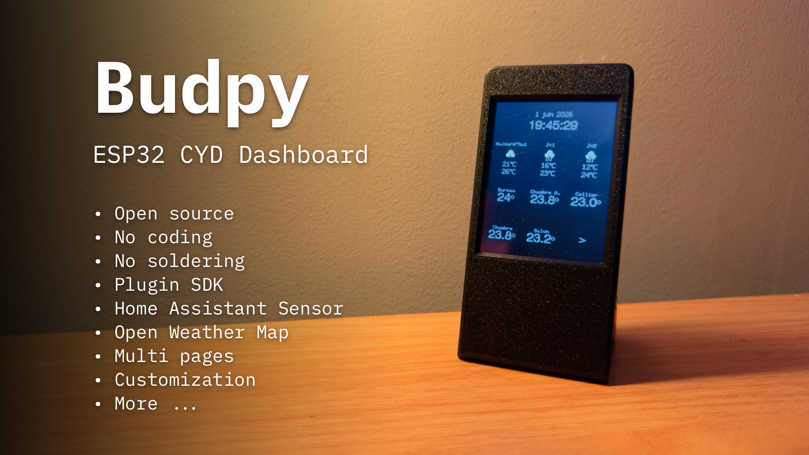

# Budpy

Budpy is an autonomous ESP32 CYD dashboard. A static web app flashes and provisions the device, then the ESP32 runs without a Budpy backend.

## Features

Budpy is a dashboard for your home, office, or workshop. You are a lot of plugins available :
- Weather forecast
- Clock / Date
- Home Assistant
  - Sensor
  - Cover

You are the possibility to create multiple pages, and to switch between them. You can also import your layout for reusing it on multiple devices.

## Plugin Development

See [docs/plugins.md](docs/plugins.md) for plugin development instructions.

## 3D print

You can find a lot of 3D printable cases for the ESP32 CYD on [Thingiverse](https://www.thingiverse.com/search?q=esp32+cyd&type=things&sort=relevant). I recommend the [Aura case](https://makerworld.com/fr/models/1382304-aura-smart-weather-forecast-display).